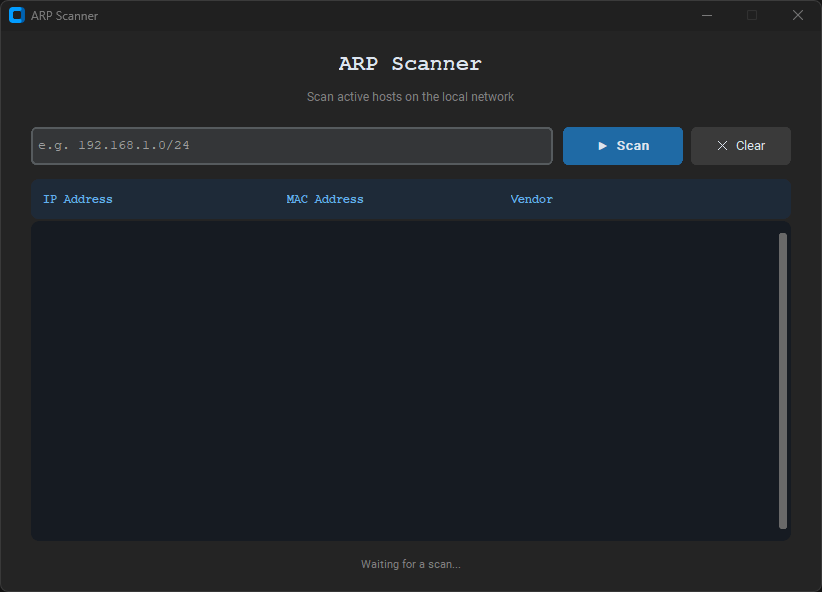

# 🔍 ARP Scanner

A simple ARP scanner with a modern dark GUI built with Python and CustomTkinter.  
Scans active hosts on the local network and shows their IP address, MAC address, and vendor.


---

## 📸 Screenshot



---

## ⬇️ Download (Windows)

1. Download the latest `arp-scan.exe` from the [Releases](../../releases) page
2. Install **[Npcap](https://npcap.com)** (required for packet capture)
3. Right-click `arp-scan.exe` → **Run as Administrator**

---

## 🛠️ Build from Source

### Requirements
- Python 3.12
- [Npcap](https://npcap.com) installed

### Steps

```bash
# Clone the repo
https://github.com/denispollini/arp-scan.git
cd arp-scan

# Run the build script
build_windows.bat
```

The executable will be created in `dist\arp-scan.exe`.

---

## 🚀 Usage

1. Run `arp-scan.exe` as Administrator
2. Enter the IP range (e.g. `192.168.1.0/24`)
3. Click **Scan**

> ⚠️ The vendor column may show **Unknown** for some devices due to the rate limit of the free [macvendors.com](https://macvendors.com) API.

---

## 📦 Dependencies

| Package | Purpose |
|---|---|
| [Scapy](https://scapy.net) | ARP packet crafting and sending |
| [CustomTkinter](https://github.com/TomSchimansky/CustomTkinter) | Modern dark GUI |
| [PyInstaller](https://pyinstaller.org) | Packaging into standalone executable |

---

## 🐧 Linux

On Linux, `arp-scan` is available natively:

```bash
sudo arp-scan --localnet
```

---

## 📄 License

MIT License — free to use, modify and distribute.
